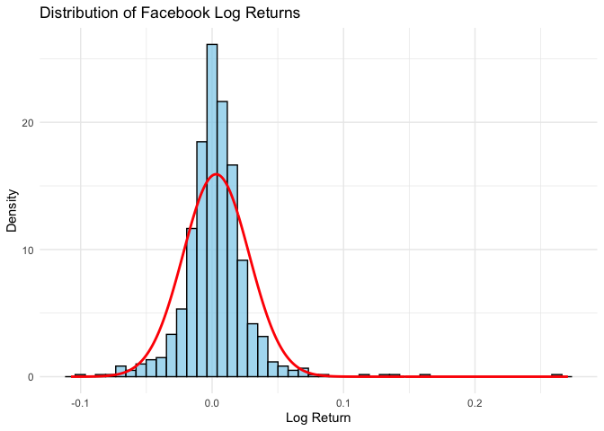

# **Models of Stock Return**

In this Notebook, I apply the concept of probability to measure the
probability that the stock price drops a certain percentage in a day,
and in a year.

I also demonstrate how to calculate the value at risk (VaR) using
python.

``` r
library(tidyverse)
```

    ## ── Attaching core tidyverse packages ──────────────────────── tidyverse 2.0.0 ──
    ## ✔ dplyr     1.1.4     ✔ readr     2.1.5
    ## ✔ forcats   1.0.0     ✔ stringr   1.5.1
    ## ✔ ggplot2   3.5.2     ✔ tibble    3.2.1
    ## ✔ lubridate 1.9.4     ✔ tidyr     1.3.1
    ## ✔ purrr     1.0.4     
    ## ── Conflicts ────────────────────────────────────────── tidyverse_conflicts() ──
    ## ✖ dplyr::filter() masks stats::filter()
    ## ✖ dplyr::lag()    masks stats::lag()
    ## ℹ Use the conflicted package (<http://conflicted.r-lib.org/>) to force all conflicts to become errors

``` r
library(readr)
library(ggplot2)
```

``` r
# Select CSV file interactively
#data <- file.choose()
```

``` r
fb <- read_csv("facebook.csv", show_col_types = FALSE)
head(fb)
```

    ## # A tibble: 6 × 7
    ##   Date        Open  High   Low Close `Adj Close`  Volume
    ##   <date>     <dbl> <dbl> <dbl> <dbl>       <dbl>   <dbl>
    ## 1 2014-12-31  20.4  20.5  20.0  20.0        19.5 4157500
    ## 2 2015-01-02  20.1  20.3  19.8  20.1        19.5 2842000
    ## 3 2015-01-05  20.1  20.2  19.7  19.8        19.2 4948800
    ## 4 2015-01-06  19.8  19.8  19.2  19.2        18.6 4944100
    ## 5 2015-01-07  19.3  19.5  19.1  19.1        18.6 8045200
    ## 6 2015-01-08  19.4  20.0  19.4  19.9        19.3 7094500

## **Distribution of Log return**

``` r
# Calculate log daily return
fb <- fb %>%
  mutate(LogReturn = log(lead(Close)) - log(Close))
```

``` r
# Estimate parameters
mu <- mean(fb$LogReturn, na.rm = TRUE)
sigma <- sd(fb$LogReturn, na.rm = TRUE)

# Create density data for the normal distribution
x_vals <- seq(min(fb$LogReturn, na.rm = TRUE) - 0.01,
              max(fb$LogReturn, na.rm = TRUE) + 0.01,
              by = 0.001)
pdf_vals <- dnorm(x_vals, mean = mu, sd = sigma)
density_df <- data.frame(x = x_vals, pdf = pdf_vals)

# Plot histogram and overlay normal distribution
ggplot(fb, aes(x = LogReturn)) +
  geom_histogram(aes(y = after_stat(density)), bins = 50, fill = "skyblue", color = "black", alpha = 0.7) +
  geom_line(data = density_df, aes(x = x, y = pdf), color = "red", linewidth = 1) +
  labs(title = "Distribution of Facebook Log Returns",
       x = "Log Return", y = "Density") +
  theme_minimal()
```

    ## Warning: Removed 1 row containing non-finite outside the scale range
    ## (`stat_bin()`).

<!-- -->

## **Calculating the probability of the stock price dropping over a certain percentage in a day**

Use the python function: q = pnorm(z, mean = mu, sd = sigma).

**🎯 What the Function Tells You:**

“What’s the probability that a value from a normal distribution (with
the given mean and standard deviation) is less than or equal to a
certain point z?”

The result q is a number between 0 and 1 (a probability).

For example, if q = 0.11, it means:

“There’s an 11% chance the return will be -z% or worse.”

``` r
# Probability that Facebook stock will drop more than 5% in a day
prob_return1 <- pnorm(-0.05, mean = mu, sd = sigma)
cat("The Probability is", prob_return1, "\n")
```

    ## The Probability is 0.01716077

``` r
# Calculate the probability that return drops over 10%
prob_return2 <- pnorm(-0.10, mean = mu, sd = sigma)
cat("The Probability is", prob_return2, "\n")
```

    ## The Probability is 1.966843e-05

## **Calculating the probability of the stock price dropping over a certain percentage in a year**

``` r
# Using `mu` and `sigma` defined above
mu220 <- 220 * mu
sigma220 <- sqrt(220) * sigma

# Compute probability of a drop > 40%
prob_drop <- pnorm(-0.4, mean = mu220, sd = sigma220)
cat("The probability of dropping over 40% in 220 days is", prob_drop, "\n")
```

    ## The probability of dropping over 40% in 220 days is 0.002027508

``` r
mu220 <- 220 * mu
sigma220 <- sqrt(220) * sigma

# Calculate probability of a drop over 20%
drop20 <- pnorm(-0.2, mean = mu220, sd = sigma220)

# Output the result
cat("The probability of dropping over 20% in 220 days is", drop20, "\n")
```

    ## The probability of dropping over 20% in 220 days is 0.009750301

## **Calculating Value at Risk (VaR)**

Value at Risk (VaR) is a risk management metric used in finance to
quantify the potential loss in value of a portfolio or investment under
normal market conditions over a set time period and with a given level
of confidence.

It answers the question:

> “What’s the maximum expected loss over a specific time horizon, with a
> certain level of confidence?”

**Limitations:**

1.  **Does not predict worst-case loss**, only a threshold.
2.  Assumes normal market conditions – **underestimates tail risk.**

A commonly used method to calculate VaR is the **Variance-Covariance
(Parametric)**, which assumes returns are normally distributed (which is
the case in my example above) and uses standard deviation.

Now let’s estimate how much you could lose in a given time frame,
**assuming returns are normally distributed.**

``` r
# 5% quantile (VaR at 95% confidence level)
VaR <- qnorm(0.05, mean = mu, sd = sigma)
cat("Single day value at risk:", VaR, "\n")
```

    ## Single day value at risk: -0.03818535

``` r
# 25% quantile
q25 <- qnorm(0.25, mean = mu, sd = sigma)
cat("25% quantile:", q25, "\n")
```

    ## 25% quantile: -0.01386627

VaR results on 5% quantile can be interpreted that there’s a 5% chance
that the return will be below

    0.03818535 

and a 95% chance it won’t be worse than that. 😊
