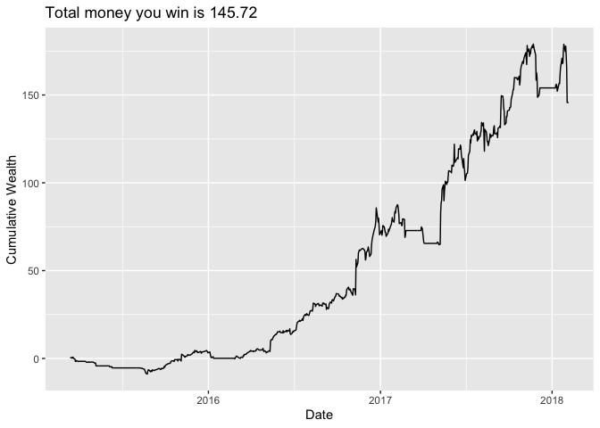

# Simple Trading Strategy

A basic moving average crossover algorithm to illustrate trading logic using **Python (pandas)** and **R**.  
> ⚠️ This is for learning purposes only. It does **not** predict market returns or guarantee profit.

---

## Strategy Overview

**Signals Used:**

- **Fast Signal (MA10):** 10-day moving average – reacts quickly to price changes  
- **Slow Signal (MA50):** 50-day moving average – reflects broader market trends

**Trading Logic:**

- **Buy (Long 1 share):** When `MA10 > MA50`  
- **Sell (Flat / 0 shares):** When `MA10 ≤ MA50`

---

## Implementation Steps

1. **Generate Trading Positions**  
   Assign 1 or 0 for each day based on signal comparison:
   ```python
   shares = [1 if ma10 > ma50 else 0 for ma10, ma50 in zip(MA10, MA50)]
````

2. **Calculate Daily Profit**
   For each day `i`, profit is:
   `Profit_i = Position_i × (Close_{i+1} - Close_i)`
   If you're flat (no position), profit = 0.

3. **Compute Cumulative Wealth**
   In R:

   ```r
   stk <- stk %>%
     mutate(wealth = cumsum(Profit))
   ```

   Where `wealth_t` is:
   `wealth_t = sum(Profit_1 to Profit_t)`

4. **Visualize the Strategy's Performance**
   Plot the equity curve:

   * **x-axis**: Date
   * **y-axis**: Cumulative Wealth

   This chart shows how the portfolio would have grown (or declined) based on the strategy:

   

